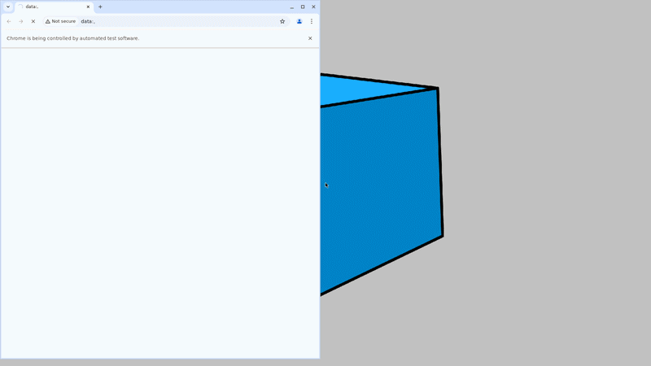
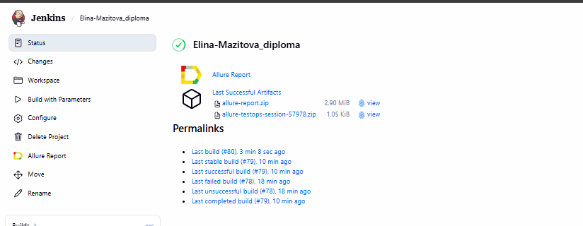
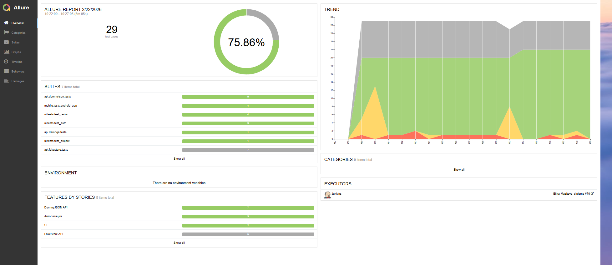
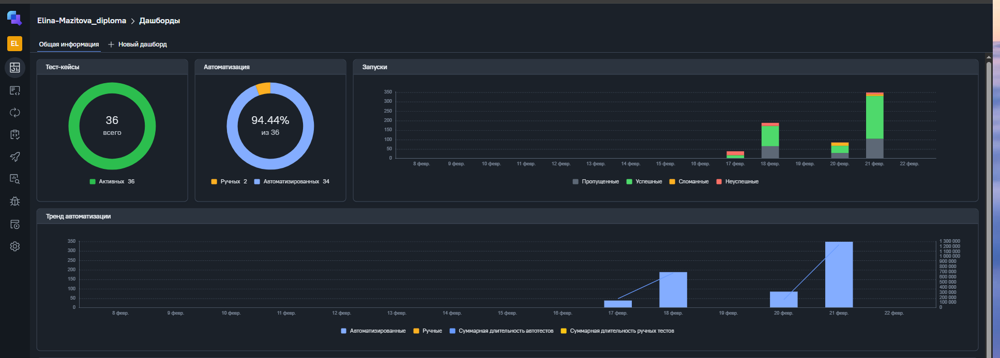
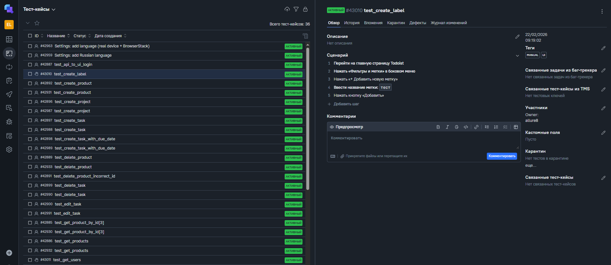
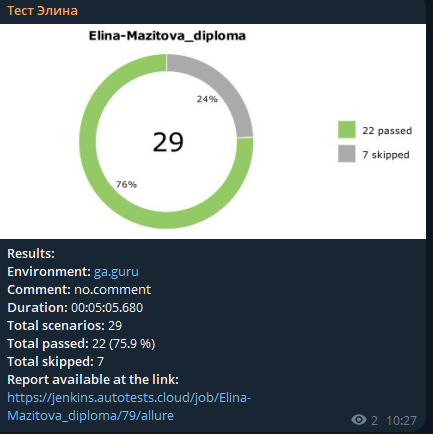

# 🎓 Diploma Project  
### UI • API • Mobile Automated Testing  

---

<h2 align="center">🛠 Стек технологий</h2>

| Технология | Описание |
|-----------|----------|
|  | язык разработки |
|  | тестовый фреймворк |
|  | обёртка над Selenium |
|  | автоматизация браузера |
|  | мобильная автоматизация |
|  | облачные устройства |
|  | API‑клиент |
|  | модели запросов/ответов |
|  | валидация схем |
|  | отчёты |
|  | управление тестами |
|  | CI/CD |
|  | уведомления |

---

<h2 align="center"> 🧩 Архитектура проекта</h2>

| Компонент | Технологии | Описание |
|----------|------------|----------|
| UI | Selene, Selenium | Page Object, тесты Todoist |
| API | Requests, Pydantic, JSON Schema | DemoQA, DummyJSON, FakeStore |
| Mobile | Appium, BrowserStack | Android‑тесты Wikipedia |
| CI/CD | Jenkins, Allure, Telegram | Полный пайплайн + уведомления |

---

<h3 align="center">  🖥️ UI (Todoist)</h3>

<table>
<tr>
<td>

### Покрытый функционал

| Раздел | Описание |
|--------|----------|
| 🔐 Авторизация | Успешный вход; негативные проверки; сообщения об ошибках |
| 📁 Проекты | Создание проекта; проверка появления в списке |
| 📝 Задачи | Создание; создание с дедлайном; редактирование; удаление |

</td>
<td width="300" align="center">

</td>
</tr>
</table>

---

<h3 align="center">  🔌 API (DemoQA, DummyJSON, FakeStore) </h3>

| API | Покрытие |
|-----|----------|
| 🧩 DemoQA | Создание пользователя; генерация токена; логин; JSON Schema; API → UI |
| 🛒 DummyJSON | Авторизация; товары (GET/POST/PUT/DELETE); схемы |
| 🏷️ FakeStore | Товары (GET/POST/PUT/DELETE); модели; схемы |

---

<h3 align="center">  📱 Mobile (Wikipedia, Android) </h3>
<table>
<tr>
<td>

| Раздел | Покрытый функционал |
|--------|----------------------|
| 🚀 Онбординг | Полное прохождение; пропуск; проверка отображения |
| ⚙️ Настройки | Добавление языка; локализации; работа на BrowserStack |
| 🔍 Поиск | Открытие поиска; ввод запроса; проверка результатов |
</td>
<td width="300" align="center">

</td>
</tr>
</table>

---

<h2 align="center"> ▶️ Запуск тестов </h2>

| Тип тестов | Команда |
|-----------|---------|
| 🖥️ UI | `pytest -m ui` |
| 🔌 API | `pytest -m api` |
| 📱 Mobile | `pytest -m mobile` |
| 🔄 Все тесты | `pytest` |

---

<h2 align="center"> 🚀 Jenkins</h2>

**Job:**  
[Ссылка на jenkins джобу](https://jenkins.autotests.cloud/job/Elina-Mazitova_diploma/)

**Скриншот:**  

---

<h2 align="center">  📊 Allure Report</h2>

**Отчёт:**  
[Ссылка на отчет](https://jenkins.autotests.cloud/job/Elina-Mazitova_diploma/79/allure/)

**Скриншот дашборд:**  

---

<h2 align="center"> 🧪 Allure TestOps</h2>

**Проект:**  
[Ссылка на проект](https://allure.autotests.cloud/project/5133/test-cases?treeId=0)

**Скриншот overview:**  

**Ручные тесты (2 шт):**  

---

<h2 align="center"> 📬 Telegram уведомления</h2>

  Сделано с 💜 для дипломного проекта QA Guru 
   
  <a href="https://github.com/Elina-Mazitova">GitHub Элины Мазитовой</a>

